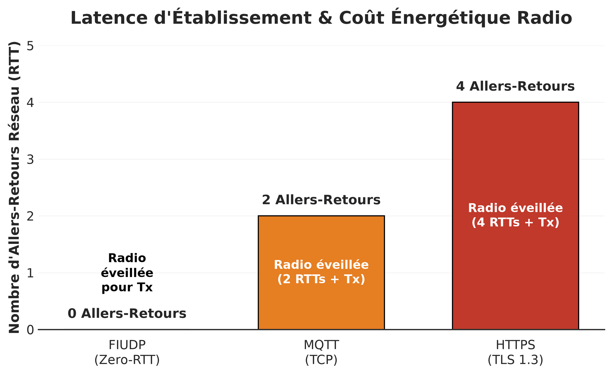
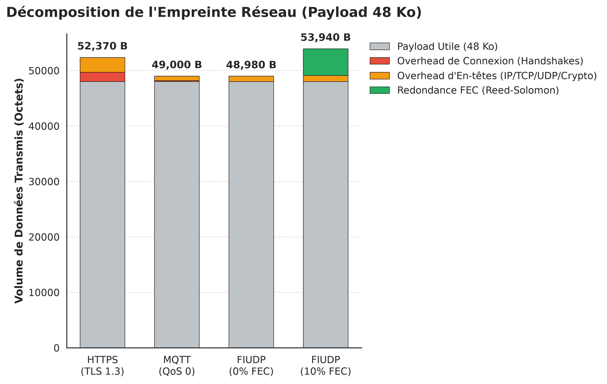
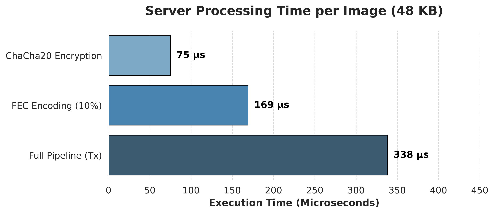

# FIUDP CLI

[](https://github.com/Thiru-sama/Fin-Amor-s-Ideal-UDP-FIUDP-CLI/actions/workflows/ci.yml)
[](https://docs.rs/fiudp-cli)

This repository provides the "Stateless Sender" implementation of the academic **FIUDP (Forward Error Corrected IoT UDP)** protocol. It is a small, sharp Rust tool that streams a raw image to a TRMNL display IP (or other constrained e-ink displays) over FIUDP.

Designed specifically for constrained e-ink displays, it features a stateless UDP transport for raw BMP frames. It sends one burst per frame in a secure and deterministic manner, applies FEC and AEAD encryption (ChaCha20-Poly1305) with a 256-bit pre-shared key, and is designed to compose well with other Unix tools.


_The Swing ("The Happy Accidents of the Swing"). Painting by Jean-Honoré Fragonard._  

## Table of contents
- [What it does](#what-it-does)
- [Why FIUDP for TRMNL](#why-fiudp-for-trmnl)
- [Benchmarks & Performance](#benchmarks--performance)
- [Architecture (Offloaded Complexity)](#architecture-offloaded-complexity)
- [Pacing (Traffic Shaping)](#pacing-traffic-shaping)
- [Install](#install)
- [Usage](#usage)
- [Configuration](#configuration)
- [Examples](#examples)
- [Philosophy & Vision](#philosophy--vision)
- [Security](#security)
- [Build](#build)
- [Test](#test)
- [Contributing](#contributing)
- [License](#license)
- [Acknowledgements](#acknowledgements)
- [Academic Publication](#academic-publication)

## What it does
- Reads a raw image from a file or stdin
- Applies FEC and authenticated encryption (ChaCha20-Poly1305) with a 256-bit pre-shared key
- Streams to a configured TRMNL display IP over FIUDP
- Exposes a clean CLI and exits with useful status codes

## Why FIUDP for TRMNL
- Stateless by design: one burst, no handshake, no keep-alive.
- No MQTT, no HTTP/JSON on embedded, no broker dependencies.
- Deterministic timing and packet size for predictable wake windows.
- Secure by default with per-shard AEAD and FEC for loss recovery.

Keywords: TRMNL, e-ink, FIUDP, UDP, stateless, raw BMP, embedded display.

## Benchmarks & Performance
FIUDP's true advantage for IoT is **Zero-RTT** and **Statelessness**. By eliminating TCP and TLS handshakes, FIUDP drastically reduces the active time of the Wi-Fi radio on the micro-controller, saving significant battery life. 

### Establishment Latency (Zero-RTT)
The Wi-Fi radio only wakes up to transmit (or receive) the payload burst, drastically reducing active time compared to TCP/TLS handshakes.



### Network Footprint (Overhead)
FIUDP with 10% FEC uses slightly more total bandwidth than HTTPS for a 48KB payload, but trades this for zero connection overhead.



### Server Processing Time
The processing time added by ChaCha20 encryption and Reed-Solomon Forward Error Correction (FEC) is negligible on the server side. Our benchmarks show that the entire preparation pipeline is executed in < 338 µs, with encryption throughput reaching 633 MiB/s.


> [!NOTE]
> Detailed metrics, network footprint comparisons, and plotting scripts are available in the [Benchmarks Documentation](docs/benchmarks/README.md).

## Architecture (Offloaded Complexity)
The core philosophy of FIUDP is to offload complexity from the constrained microcontroller to the sender. This CLI tool handles the heavy lifting:

1. **Image Processing**: Performs dithering and prepares the raw BMP payload.
2. **Forward Error Correction**: Encodes the payload using Reed-Solomon RS(39,35) to ensure resilience against packet loss.
3. **Cryptography**: Secures the data with ChaCha20-Poly1305 authenticated encryption (AEAD) using a 256-bit pre-shared key.
4. **Streaming**: UDP burst to the target TRMNL display.

Unix principles observed:
- Do one thing well
- Compose with pipes
- Text-based config
- Predictable exit codes

## Pacing (Traffic Shaping)
A key feature of the FIUDP stateless sender is the configurable inter-packet delay (e.g., 25ms). This pacing acts as a crucial traffic shaping mechanism to avoid fragmenting or overflowing the LwIP heap on the target microcontroller, ensuring reliable packet processing even on severely constrained hardware.

## Install

### From crates.io
```sh
cargo install fiudp-cli
```

### From source
```sh
git clone https://github.com/Thiru-sama/Fin-Amor-s-Ideal-UDP-FIUDP-CLI.git
cd fiudp-cli
cargo install --path .
```

## Usage
```sh
fiudp --image ./frame.raw --wake-at 3600 --target 192.0.2.10
```

One-liner:
```sh
cat frame.raw | fiudp --wake-at 3600 --target 192.0.2.10 --key-file ./psk.bin
```

### Help
```sh
fiudp --help
```

## Configuration

CLI options:
- `--target` destination IPv4 address (alias: `--ip`)
- `--wake-at` wake timer in seconds for the next sync cycle (alias: `--rendezvous`)
- `--image` path to the raw input file (alias: `--input`, omit to read stdin)
- `--key-file` path to the 32-byte pre-shared key
- `--parity-ratio` percentage of parity shards to generate
- `--port` UDP port (default: 5050)
- `--delay-us` inter-packet delay in microseconds (default: 500)

## Examples

Stream from stdin:
```sh
cat frame.raw | fiudp --wake-at 3600 --target 192.0.2.10
```

Custom port and delay:
```sh
fiudp --image ./frame.raw --wake-at 1800 --target 192.0.2.10 --port 5051 --delay-us 1000
```

## Philosophy & Vision
FIUDP treats the network as a short, asynchronous burst, not a leash. It takes a raw BMP frame, splits it into secure UDP shards, sends once, then stops. No handshake, no keep-alive, no constant chatter. The terminal wakes, verifies, displays, and sleeps again. The device is a calm canvas or a personal tool, not a talkative box on the network.

Durability comes from refusing web bloat. FIUDP limits scope to raw pixels plus ChaCha20-Poly1305 and FEC. No HTTP/JSON on embedded, no MQTT, no cloud broker. The protocol is fixed, deterministic, and agnostic: if hardware can render pixels and receive UDP, this code still works years later, with the terminal effectively timeless.

## Security
- ChaCha20-Poly1305 uses a 256-bit pre-shared key; this provides post-quantum resilience against Grover's algorithm, but it is not an asymmetric PQ KEM or "PQS suite"
- Packet headers are authenticated as AAD; tampering with session ID, shard index, or rendezvous timer should fail authentication on the receiver
- Prefer trusted networks; encryption does not prevent spoofing, metadata leakage, or DoS

## Build
```sh
cargo build --release
```

## Test
```sh
cargo test
```

## Contributing
- This is a personal tool; I am not actively accepting PRs
- Feel free to fork or reproduce it for your own needs
- Run `cargo fmt` and `cargo clippy` if you modify the code

## License
GNU GPL v3. See LICENSE.

## Acknowledgements
- TRMNL display ecosystem
- Rust community

## Academic Publication
Read the full research paper on Zenodo: [[Link to DOI](https://doi.org/10.5281/zenodo.20813328)]
